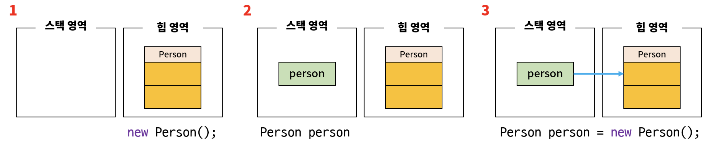

## Object (객체)
- 현실 속의 객체: 세상에 존재하는 의사나 행위가 미치는 대상
- 소프트웨어 관점에서의 객체: 현실 세계에서의 객체와 유사한 어떠한 창조물

## Class
- 소프트웨어 관점에서의 객체를 만들기 위한 설계도
- 객체를 코드로 구현한 것
- 객체들의 협력 관계를 코드로 구현한 것
- 멤버변수: 클래스를 통해 만들어진 객체가 갖고 있는 속성
- 메서드: 객체와 관련된 동작이나 행위

## Instance
- 클래스를 바탕으로 객체를 실체화 한 것
- 실제로 메모리에 할당된 객체
- 인스턴스화: 클래스를 바탕으로 객체를 실체화하는 과정
````
Person person = new Person();
````

1. new Person(); 을 통해 Person 클래스를 바탕으로 한 인스턴스 생성
2. Person 이라는 클래스 자료형으로 person 변수 선언. 이 변수는 지역변수이기 때문에 스택 메모리에 생성
3. 대입연산자(=)를 통해 우측 인스턴스의 주소 값(해시코드 값)을 좌측 person 변수에 할당
4. person 변수는 인스턴스의 메모리 주소 값을 참조하고 있어서 참조 변수라고 부름