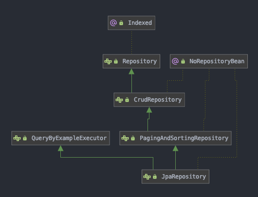
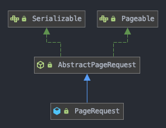

# Pageable

- JpaRepository의 부모 인페이스인 PagingAndSortingRepository 에서 paging과 sorting 기능 제공



- PageRequest 객체는 Pageable 인터페이스를 상속받음
- sort, offset, page 정보를 넘길 수 있음

## 쿼리 메소드로 페이징
````
PageRequest pageable = PageRequest.of(page, size);
````
````
public interface UserRepository extends JpaRepository<User, Long> {
    Page<User> findByAddress(String address, Pageable pageable);
}
````
- 두번째 파라미터로 Pageable을 넘겨줌

## Paging 반환타입
1. Page<T>
- 일반적인 게시판 페이지 형태
- offset과 total page 수고 페이징 서비스 제공
- count 쿼리를 포함하 페이징으로 count 쿼리가 자동으로 생성됨
2. Slice<t>
- 더보기 형태의 페이징
- 추가 count 쿼리 없이 다음 페이지 조회 가능