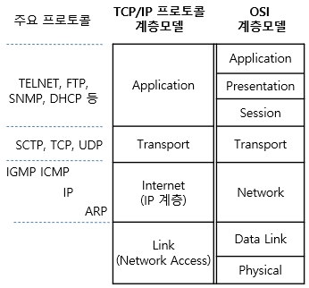

# TCP/IP 4계층 모델

## 애플리케이션 계층
- FRP, HTTP, SSH, SMTP, DNS 등 응용 프로그램이 사용되는 프로토콜 계층
- 웹 서비스, 이메일 등 서비스를 실질적으로 사람들에게 제공하는 층

## 전송 계층
- 송신자와 수신자를 연결하는 통신 서비스를 제공하며 연결 지향 데이터 스트림 지원, 신뢰성, 흐름제어를 제공
- 애플리케이션과 인터넷 계층 사이의 데이터가 전달될 때의 중계 역할
- 예: TCP,UDP
- TCP: 패킷 사이의 순서를 보장하고 연결지향 프로토콜을 사용해서 연결을 하여 신뢰성을 구축해
수신여부를 확인. 가상회선 패킷 교환 방식 사용
- UDP: 순서를 보장하지 않고 수신 여부를 확인하지 않으며 단순히 데이터만 주는 데이터그램 패킷 교환방식 사용
- 가상회선 패킷 교환 방식: 각 패킷에는 가상회선 식별자가 포함되며 모든 패킷을 전송하면 가상 회선이 해제되고 패킷들은 전송된 순서대로 도착하는 방식
- 데이터그램 패킷 교환 방식: 패킷이 독립적으로 이동하며 최적의 경로를 선택하여 가는데 하나의 메시지에서 분할된 여러 패킷은 서로 다른 경로로 전송될 수 있으며
도착한 순서가 다를 수 있는 방식

### TCP 연결 성립 과정
- 3-way-handshake 작업 진행
1. SYN: 클라이언트는 서버에 클라이언트의 ISN을 담아 SYN 보냄
   - ISN: 새로운 TCT 연결의 첫번째 패킷에 할당된 임의의 시퀀스 번호
2. SYN + ACK: 서버는 클라이언트의 SYN을 수신하고 서버의 ISN을 보내며 승인번호로 클라이언트의 ISN + 1을 보냄
3. ACK: 클라이언트는 서버의 ISN + 1한 값인 승인번호를 담아 ACK를 서버에 보

### TCP 연결 해제 과정
- 4-way-handshake 과정 발생
1. 클라이언트가 연결을 닫으려고 할 때 FIN으로 설정된 세그먼트 보냄.
클라이언트는 FIN_WAIT_1 상태로 들어가고 서버의 응답을 기다림
2. 서버는 클라이언트로 ACK라는 승인 세그먼트를 보낸 후 CLOSE_WAIT 상태에 들어감.
클라이언트가 세그먼트를 받으면 FIN_WAIT_2 상태에 들어감
3. 서버는 ACK를 보내고 일정 시간 이후에 클라이언트에 FIN이라는 세그먼트를 보냄
4. 클라이언트는 TIME_WAIT 상태가 되고 다시 서버로 ACK를 보내서 서버는 CLOSED 상태가 됨
클라이언트는 어느 정도의 시간을 대기한 후 연결이 닫히고 클라이언트와 서버의 모든 자원의 연결이 해제됨

## 인터넷 계층
- 장치로부터 받은 네트워크 패킷을 IP주소고 지정된 목적지로 전송하기 위해 사용되는 계층
- IP, ARP, ICMP
- 패킷을 수신해야 할 상대의 주소를 지정하여 데이터를 전달
- 상대방이 제대로 받았는지에 대해 보장하지 않는 비연결형적인 특징

## 링크 계층
- 전선, 광섬유, 무선 등으로 실질적으로 데이터를 전달하며 장치 간에 신호를 주고받는 규칙을 정하는 계층
- 네트워크 접근 계층이라고도 함
- 물리계층과 데이터링크 계층으로 나누기도 함
- 물리 계층: 무선 LAN과 유선 LAN을 통해 0과 1로 이루어진 데이터를 보내는 계층
- 데이터 링크 계층: 이더넷 프레임을 통해 에러 확인, 흐름 제어, 접근제어 담당하는 계층