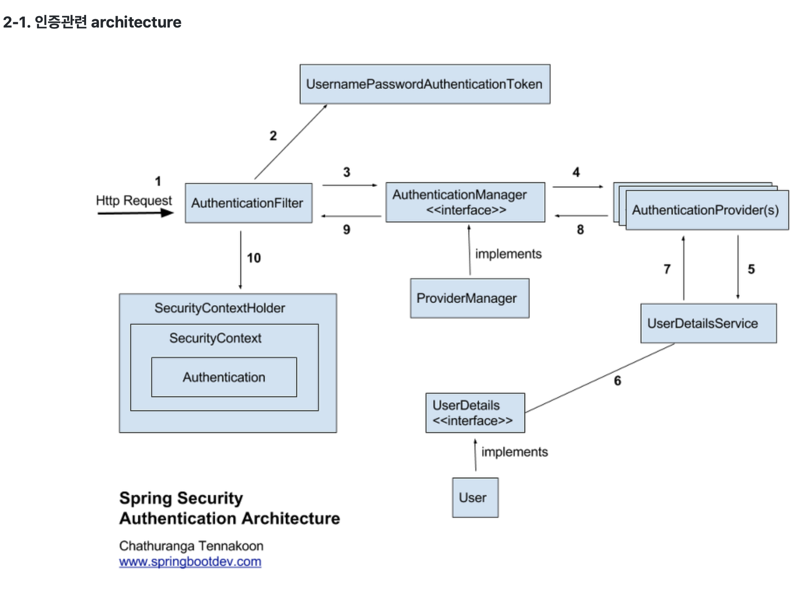

Spring Security
================
### 인증(Authorizatoin)과 인가(Authentication)
- 인증(Authentication): 해당 사용자가 본인이 맞는지를 확인하는 절차
- 인가(Authorization): 인증된 사용자가 요청한 자원에 접근 가능한지를 결정하는 절차
- Spring Security는 기본적으로 인증 절차를 거친 후에 인가 절차를 진행하게 되며, 인가 과정에서 해당 리소스에 대한 접근 권한이 있는지 확인
- Spring Security에서는 이러한 인증과 인가를 위해 Principal을 아이디로, Credential을 비밀번호로 사용하는 Credential 기반의 인증 방식을 사용
  - Principal(접근 주체): 보호받는 Resource에 접근하는 대상
  - Credential(비밀번호): Resource에 접근하는 대상의 비밀번호

### Spring Security 주요 모듈

#### Authentication
- 현재 접근하는 주체의 정보와 권한을 담는 인터페이스
- SecurityContext에 저장
- SecurityContextHolder를 통해 SecurityContext에 접근하고, SecurityContext를 통해 Authentication 에 접근

#### SecurityContext
- Authentication을 보관하는 역할
- SecurityContext를 통해 Authentication 객체를 꺼내올 수 있음

#### SecurityContextHolder
- SecurityContextHolder는 보안 주체의 세부 정보를 포함하여 응용 프로그램의 현재 보안 컨텍스트에 대한 세부 정보가 저장

#### AuthenticationProvider
- 실제 인증에 대한 부분을 처리
- 인증 전의 Authentication 객체를 받아서 인증이 완료된 객체를 반환하는 역할

#### AuthenticationManager
- 인증에 대한 부분은 AuthenticationManager를 통해서 처리하게 되는데, 실질적으로는 AuthenticationManager에 등록된 AuthenticationProvider에 의해 처리
- 인증이 성공하면 isAuthenticated=true 인 객체를 생성하여 SecurityContext에 저장
- 실패할 경우에는 AuthenticationException을 발생

#### UsernamePasswordAuthenticationToken
- Authentication을 implements한 AbstractAuthenticationToken의 하위 클래스로 username이 Principal의 역할을 하고, password가 Credential의 역할
- 첫번째 생성자는 인증 전의 객체를 생성하고, 두번째 생성자는 인증이 완료된 객체를 생성

#### UserDetails
- 인증에 성공하여 생성된 UserDetails 객체는 UsernamePasswordAuthenticationToken을 생성하기 위해 사용
- UserDetails 인터페이스의 경우 직접 개발한 ApplicationUser에 UserDetails를 implements하여 사용


#### UserDetailsService
- UserDetails 객체를 반환하는 단 하나의 메소드를 가지고 있는데, 일반적으로 이를 구현한 클래스의 내부에 UserRepository를 주입받아 DB에 연결하여 처리

#### GrantedAuthority
- 현재 사용자(Principal)가 가지고 있는 권한들
- 보통 ROLE_ADMIN, ROLE_USER와 같이 ROLE_의 형태로 사용

### Spring Security 인증 처리 과정
- username과 password를 조합해서 UsernamePasswordAuthenticationToken 인스턴스를 만듦
- 이 토큰은 검증을 위해 AuthenticationManager의 인스턴스로 전달
- AuthenticationManager는 인증에 성공하면 Authentication 인스턴스를 리턴
- 이 Authentication 인스턴스는 SecurityContextHolder에 저장

### dependency 추가
````
implementation 'org.springframework.boot:spring-boot-starter-security'
````
   
### 설정
#### Security Config class 작성
 ````
 package com.shop.projectlion.global.config;
    
    import org.springframework.context.annotation.Bean;
    import org.springframework.context.annotation.Configuration;
    import org.springframework.security.config.annotation.web.builders.HttpSecurity;
    import org.springframework.security.config.annotation.web.configuration.EnableWebSecurity;
    import org.springframework.security.config.annotation.web.configuration.WebSecurityConfigurerAdapter;
    import org.springframework.security.crypto.bcrypt.BCryptPasswordEncoder;
    import org.springframework.security.crypto.password.PasswordEncoder;
    
    @Configuration
    @EnableWebSecurity
    public class SecurityConfig extends WebSecurityConfigurerAdapter {
    
        @Override
        protected void configure(HttpSecurity http) throws Exception {
            // http 요청에 대한 보안 설정
            // 페이지 권한 설정, 로그인 페이지 설정, 로그아웃 메소드 등에 대한 설정 작성
   
            http.formLogin()
                .loginPage("/login")
                .defaultSuccessUrl("/")
                .usernameParameter("email")
                .failureUrl("/login/error")
                .and()
                .logout()
                .logoutRequestMatcher(new AntPathRequestMatcher("/logout"))
                .logoutSuccessUrl("/");
        }
    
        @Bean
        public PasswordEncoder passwordEncoder() {
            return new BCryptPasswordEncoder();
        }
    }
 ````
 - WebSecurityConfigurerAdapter를 상속받는 클래스에 @EnableWebSecurity 어노테이션을 선언하면 SpringSecurityFilterChain이 자동으로 포함
 - WebSecurityConfigurerAdapter를 상속받아서 메소드 오더라이딩을 통해 보안 설정을 커스터마이징 할 수 있다
 - BCryptPasswordEncoder의 해시 함수를 이용하여 비밀번호를 암호화하여 저장


#### Web Security 설정
   ````
   web.ignoring().antMatchers("/css/**", "/js/**", "/img/**", "/lib/**"); 
   ````
- Spring Security에서 해당 요청은 인증 대상에서 제외시킴

#### HttpSecurity 설정
- HTTP 요청에 대한 보안을 설정할 수 있음
````
      http.authorizeRequests()
       .antMatchers("/member/**").authenticated()
       .antMatchers("/admin/**").authenticated()
       .antMatchers("/**").permitAll();
````
- authorizeRequests(): HttpServletRequest에 따라 접근 제한
- antMatchers("pathPattern"): 요청 url 경로 패턴 지정 
- authenticated(): 인증된 유저만 접근 허용
- permitAll(): 모든 유저 접근 허용
- anonymous(): 인증되지 않은 유저만 접근 허용
- denyAll(): 모든 유저에 대해 접근을 허용하지 않음
 
#### 로그인 설정
- formLogin(): 로그인 설정 진행
- loginPage("path"): 커스텀 로그인 페이지 경로와 로그인 인증 경로를 등록
- defaultSuccessUrl("path"): 로그인 인증을 성공하면 이동하는 페이지 등록

#### 로그아웃 설정
- logout(): 로그아웃 설정 진행
- logoutRequestMatcher(new AntPathRequestMatcher("path")): 로그아웃 경로 지정
- logoutSuccessUrl("/path"): 로그아웃 성공 시 이동할 페이지 등록
- invalidateHttpSession(true): 로그아웃 성공 시 세션 제거
      
#### 권한 없는 사용자 점근 시 설정
- .exceptionHandling().accessDeniedPage("/path"): 권한 없는 사용자가 접근 시 이동할 페이지 등록

#### 인증 예외 시
- AuthenticationException 호출
- AuthenticationEntryPoint 인터페이스로 커스텀 가능

#### 인가 예외 시
- AccessDeniedException 호출
- AccessDeniedHandler 인터페이스로 커스텀 가능

````
http
  .exceptionHandling()
    .authenticationEntryPoint()
    .accessDeniedHandler()
    ;
````
         

