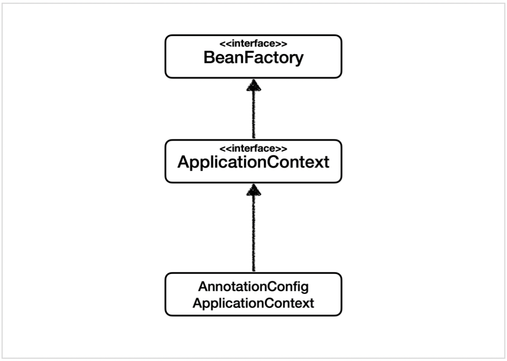
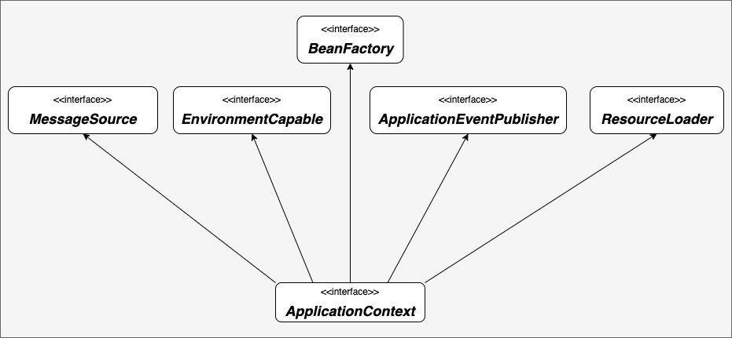

# 스프링 컨테이너와 스프링 빈
## 스프링 컨테이너 생성
````
ApplicationContext applicaitonContext = 
    new AnnotationConfigApplicationContext(AppConfig.class);
````
- ApplicationContext를 스프링 컨테이너라 함
- ApplicationContext는 인터페이스
- 스프링 컨테이너는 XML을 기반으로 만들 수 있고, 애노테이션 기반의 자바 설정 클래스로 만들 수 있음
- AppConfig를 사용했던 방식이 애노테이션 기반의 자바 설정 클래스로 스프링 컨테이너를 만든 것


- 스프링 컨테이너를 부를 때 BeanFactory, ApplicationContext로 구분
- BeanFactory를 직접 사용하는 경우는 거의 없으므로 일반적으로 ApplicationContext를 스프링 컨테이너라 함

### 스프링 컨테이너 생성 과정
1. 스프링 컨테이너 생성
- new AnnotationConfigApplicationContext(AppConfig.class);
- 스프링 컨테이너를 생성할 때는 구성 정보를 지정해주어야 함 (위 예시에서는 AppConfig로 지정)
2. 스프링 빈 등록
- 스프링 컨테이너는 파라미터로 넘어온 설정 클래스 정보를 사용해서 스프링 빈을 등록
  - 빈 이름
    - 빈 이름은 메서드 이름을 사용
    - 빈 이름을 직접 부여 가능
    - ex) @Bean(name="memberService")
    - 빈 이름은 항상 다른 이름을 부여해야 함. 같은 이름을 부여하면 다른 빈이 무시되거나 기존 빈을 덮어버리거나 설정에 따라 오류 발생
3. 스프링 빈 의존관계 설정
- 스프링 컨테이너는 설정 정보를 참고해서 의존관계를 주입


- 스프링 빈을 생성하고 의존관계를 주입하는 단계를 나눠뒀지만, 실제 자바 코드로 스프링 빈을 등록하면 생성자를 호출하면서 의존관계 주입도 한번에 처리

### 컨테이너에 등록된 빈 조회
- ac.getBeanDefinitionNames(): 스프링에 등록된 모든 빈 이름 조회
- ac.getBean(): 빈 이름으로 빈 객체(인스턴스) 조회
- 스프링 내부에서 사용하는 빈은 getRole()로 구분
  - ROLE_APPLICATION: 일반적으로 사용자가 정의한 빈 
  - ROLE_INFRASTRUCTURE: 스프링이 내부에서 사용하는 빈
- 기본적인 조회 방법
  - ac.getBean(빈이름, 타입)
  - ac.getBean(타입)
- 조회 대상 스프링 빈이 없으면 NoSuchBeanDefinitionException 예외 발생
- ac.getBeansOfType(타입): 해당 타입의 모든 빈 조회
- 부모 타입으로 조회하면 자식 타입도 함께 조회
- 모든 자바 객체의 최고 부모인 Object 타입으로 조회하면 모든 스프링 빈을 조회

## BeanFactory와 ApplicationContext

### BeanFactory
- 스프링 컨테이너의 최상위 인터페이스
- 스프링 빈을 관리하고 조회하는 역할 담당
- getBean()을 제공

### ApplicationContext
- BeanFactory 기능을 모두 상속받아 제공
- ApplicationContext가 제공하는 부가기능

- 메시지소스를 활용한 국제화 기능
- 환경변수
- 어플리케이션 이벤트
- 편리한 리소스 조회

### 정리
- ApplicationContext는 BeanFactory의 기능을 상속받음
- ApplicationContext는 빈 관리기능 + 편리한 부가기능을 제공
- BeanFactory를 직접 사용할 일은 거의 없음. 부가기능이 포함된 ApplicationContext를 사용
- BeanFactory나 ApplicationContext를 스프링 컨테이너라 함

## 다양한 설정 형식 지원 - 자바 코드, XML
- 스프링 컨테이너는 다양한 형식의 설정 정보를 받아드릴 수 있게 유연하게 설계되어 있음
  - 자바, XML, Groovy 등

## 스프링 빈 설정 메타 정보 - BeanDefinition
- BeanDefinition을 빈 설정 메타정보라 함
- @Bean, <bean>당 각 하나식 메타 정보가 생성
- 스프링 컨테이너는 이 메타정보를 기반으로 스프링 빈 생성
- BeanClassName: 생성할 빈의 클래스 명 (자바 설정 처럼 팩토리 역할의 빈을 사용하면 없음)
- factoryBeanName: 팩토리 역할의 빈을 사용할 경우 이름. ex) appConfig
- factoryMethodName: 빈을 생성할 팩토리 메서드 지정. ex) memberService
- Scope: 싱글톤(기본값)
- lazyInit: 스프링 컨테이너를 생성할 때 빈을 생성하는 것이 아니라 실제 빈을 사용할 때가지 최대한 생성을 지연처리 하는지 여부
- InitMethodName: 빈을 생성하고, 의존관계를 적용한 뒤에 호출되는 초기화 메서드 명
- DestroyMethodName: 빈의 생명주기가 끝나서 제거하기 직전에 호출되는 메서드명
- Constructor arguments, Properties: 의존관계 주입에서 사용 (자바 설정 처럼 팩토리 역할의 빈을 사용하면 없음)
- BeanDefinition을 직접 생성해서 스프링 컨테이너에 등록할 수 있음 -> 실무에서는 BeanDefinition을 직접 정의하거나 사용할 일은 거의 없음