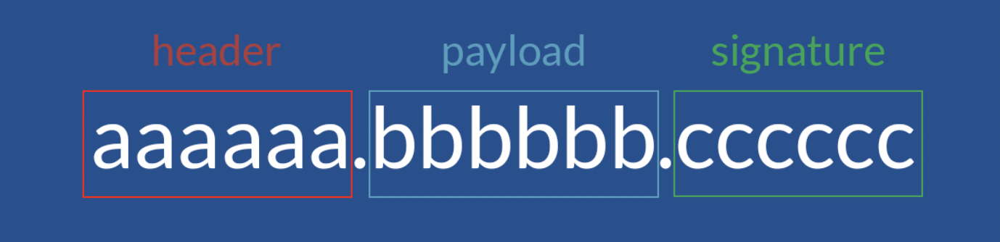

# JWT
- JSON Web Token
- 전자 서명 된 URL-safe (URL로 이용할 수있는 문자 만 구성된)의 JSON
- 전자 서명은 JSON 의 변조를 체크 할 수 있음
- JWT는 속성 정보 (Claim)를 JSON 데이터 구조로 표현한 토큰
- JWT는 서버와 클라이언트 간 정보를 주고 받을 때 Http 리퀘스트 헤더에 JSON 토큰을 넣은 후
서버는 별도의 인증 과정없이 헤더에 포함되어 있는 JWT 정보를 통해 인증
- 이때 사용되는 JSON 데이터는 URL-Safe 하도록 URL에 포함할 수 있는 문자만으로 만듦
- JWT는 HMAC 알고리즘을 사용하여 비밀키 또는 RSA를 이용한 Public Key/ Private Key 쌍으로 서명할 수 있음

## JWT 토큰 구성

- JWT는 세 파트로 나누어지며, 각 파트는 점로 구분하여 xxxxx.yyyyy.zzzzz 이런식으로 표현
- 순서대로 헤더(Header), 페이로드(Payload), 서명(Sinature)로 구성
- Base64 인코딩의 경우 “+”, “/”, “=”이 포함되지만 JWT는 URI에서 파라미터로 사용할 수 있도록 URL-Safe 한  Base64url 인코딩을 사용
- Header는 토큰의 타입과 해시 암호화 알고리즘으로 구성
- 첫째는 토큰의 유형 (JWT)을 나타내고, 두 번째는 HMAC, SHA256 또는 RSA와 같은 해시 알고리즘을 나타내는 부분
- Payload는 토큰에 담을 클레임(claim) 정보를 포함
- Payload에 담는 정보의 한 조각을 클레임이라고 부르고, 이는 name / value 의 한 쌍으로 이뤄져있음
- 토큰에는 여러개의 클레임 들을 넣을 수 있음 
- 클레임의 정보는 등록된(registered) 클레임, 공개(public) 클레임, 비공개(private) 클레임 세 종류
- Signature는 secret key를 포함하여 암호화

## JWT process

1. 사용자가 id와 password를 입력하여 로그인을 시도합
2. 서버는 요청을 확인하고 secret key를 통해 Access token을 발급
3. JWT 토큰을 클라이언트에 전달
4. 클라이언트에서 API를 요청할때 클라이언트가 Authorization header에 Access token을 담아서 보냠
5. 서버는 JWT Signature를 체크하고 Payload로부터 사용자 정보를 확인해 데이터를 반환
6. 클라이언트의 로그인 정보를 서버 메모리에 저장하지 않기 때문에 토큰기반 인증 메커니즘을 제공

- 인증이 필요한 경로에 접근할 때 서버 측은 Authorization 헤더에 유효한 JWT 또는 존재하는지 확인
- JWT에는 필요한 모든 정보를 토큰에 포함하기 때문에 데이터베이스과 같은 서버와의 커뮤니케이션 오버 헤드를 최소화 할 수 있음
- Cross-Origin Resource Sharing(CORS)는 쿠키를 사용하지 않기 때문에 
JWT를 채용 한 인증 메커니즘은 두 도메인에서 API를 제공하더라도 문제가 발생하지 않음
- 처음 사용자를 등록할 때 Access token과 Refresh token이 모두 발급되어야 함